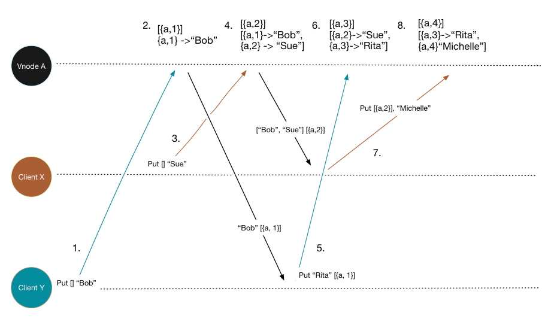

# Dotted Version Vectors In Riak

[Last time](http://basho.com/posts/technical/vector-clocks-revisited/)
I wrote about vnode version vectors, and how they simplify client
interaction with Riak, while keeping logical clock sizes small. I also
mentioned a bug: "sibling explosion." This post is going to describe
that bug, and the fix for it: Dotted Version Vectors.

There is a lot of other material about Dotted Version Vectors out
there, including
[Sean Cribbs' Talk](https://www.youtube.com/watch?v=3SWSw3mKApM), an
excellent
[Github repo and README](https://github.com/ricardobcl/Dotted-Version-Vectors)
from [Ricardo Tomé Gonçalves]( http://haslab.uminho.pt/tome), and a
paper
[Scalable and Accurate Causality Tracking for Eventually Consistent Stores](http://haslab.uminho.pt/tome/files/dvvset-dais.pdf). This
blog post covers only the application of Dotted Version Vectors in
Riak.

## Vnode Version Vector Recap

In the last post we saw how Vnode version vectors tweak the standard
version vector algorithm. Let's quickly recap how.

With a _ClientId Version Vector_ Riak generated siblings like this:

5. If Local Version Vector _descends_ Incoming
    1. Discard/ignore incoming write
6. If Incoming _descends_ Local
    1. Write new value to disk
7. If Incoming _concurrent_ with Local
    1. _Merge_ Incoming and Local Version Vectors
    2. Store Incoming value as a _sibling_

But with Vnode Version Vectors this becomes:

1. If Incoming _descends_ Local
    1. Increment Vnode's entry in _incoming_ Version Vector
    1. Write new value to disk
1. Otherwise
    1. _Merge_ Incoming and Local Version Vectors
    1. Increment Vnode's entry in _merged_ Version Vector
    1. Store Incoming value as a _sibling_

We use a single version vector to cover the full set of sibling
values. But a version vector is not enough to correctly track
causality when the actor, the vnode, is a proxy for multiple clients.

## Sibling Explosion

What is Sibling Explosion, and how does it happen?

Imagine two clients `X`, and `Y`. They're both updating the same
key. For simplicity this illustration will use Riak's `Return Body`
option, which means Riak replies to every `PUT` with the latest result
it stored on disk at the coordinating vnode. This is just simpler than
having the client fetch after every `PUT`.

In the above diagram we see a "sibling explosion."  Vnode Version
Vectors are incapable of tracking causality in a fine grained manner,
and these interleaving writes generate _false concurrency_. Let's walk
through the steps as numbered on the diagram.

1. Client Y PUTs the value "Bob" with an empty context.

2. Vnode A sees that `[]` _descends_ the local Version Vector (also
   `[]`) and increments its entry in the incoming Version Vector,
   storing the value with new version Vector `[{a, 1}]`. The value
   `"Bob"` and context `[{a, 1}]` are returned to Client Y.

3. Client X PUTs the value "Sue" with an empty context. This PUT is
   causally concurrent with Client Y's at Step 1.

4. Using the algorithm described above, Vnode A detects that the
   context `[]` does not _descend_ `[{a, 1}]` and treats the write as
   concurrent, it increments the local Version Vector to `[{a, 2}]`
   and stores the incoming value as a `sibling`. So far so good. The
   Vnode Version Vector correctly captured concurrency! Vnode A
   returns the sibling values `["Bob", "Sue"] [{a, 2}]` to Client X.

5. Client Y PUTs the value "Rita" with the context
   `[{a, 1}]`. Remember that Client Y saw the result of its own PUT
   before Client X PUT at step 3.

6. Vnode A detects that the incoming Version Vector `[{a, 1}]` does
   not _descend_ the local Version Vector of `[{a, 2}]`. It increments
   its entry in the local Version Vector, and adds "Rita" as a sibling
   value. Wait! What? We _know_ that Client Y _saw_ "Bob" as a value,
   after all, it PUT that value! So "Rita" should at least _replace_
   "Bob". Yes, it is concurrent with "Sue", but only "Sue".

7. Client X PUTs a new value "Michelle" with context
   `[{a, 2}]`. Client Y means to replace what it has read, the sibling
   values "Bob" and "Sue" with a new, single value "Michelle".

8. As before Vnode A detects that `[{a, 2}]` does not _descend_
   `[{a, 3}]` and adds the incoming value as a sibling. Again, we can
   see this is wrong. At Step 4 Client X saw both "Bob" and "Sue" and
   this new write intends to replace those values.

### What Just Happened?

Vnode A loses some essential causal information. At Step 4 it ends up
storing both "Bob" and "Sue" with a Version Vector of `[{a, 2}]`. It
has "forgotten" that "Bob" was associated with time `[{a, 1}]`. When
Client Y PUTs again, with the now stale context of `[{a,1}]` the Vnode
is unable to determine that this PUT means to replace "Bob" since
"Bob" is now associated with the version vector `[{a, 2}]`.

## Dots To The Rescue

What we need is a fine grained mechanism to detect which siblings are
removed by an update, and which siblings are actually concurrent or
unrelated causally. That mechanism is the "dot". Recall the basics of
a Version Vector: that each actor must update its own entry in the
vector by incrementing a counter. This counter is a summary of all the
actors events. An entry `{a, 4}` says that actor `a` has issued 4
updates. Integers make great summaries. 4 includes 1, 2, 3, 4. Each of
those steps that the counter went through is an update. And that is
all a dot is: a single update, an event. Take the update `{a,
4}`. That is an event, an update, a dot. You can think of the Version
Vector entry `{a, 4}` as a set of discrete events, and a dot as any
one of those events.

Hopefully the diagram above illustrates this. It's two different
visual representations of the same Version Vector
`[{A, 4}, {B, 2}, {C, 3}]`. The one on the right is a type of
visualization I first saw when working with a group of academics from
University Minho, and it helps illustrate the idea of Version Vectors
and the history they summarize. The one on the left "explodes" the
version vector into its discrete events.

## Dot The clocks

How does this help with the problem described above? We change the
algorithm again. When we increment the version vector to store a new
value, we take that latest event and store it, as a dot, with the
value.
    
    [{a, 2}]
    ["Bob", "Sue"]

Becomes
    
    [{a, 2}]
    [{a,1} -> "Bob",
     {a, 2} -> "Sue"]

That's all we have to do add fine grained causality tracking. Now when
we have interleaving writes as above, we can see which sibling values
an update replaces, and which it does not, by comparing the incoming
version vector with the dots for each value. If the version vector
_descends_ the dot, the client has seen that value and the new write
supersedes it. If the version vector is concurrent with the dot,
retain that value as a truly concurrent write, or sibling.

This diagram shows Step 6 again, this time with Dotted Version
Vectors. We can see that the extra metadata, the Dot stored with a
value, enables Riak to discard the value "Bob" since the incoming
Version Vector of `[{a, 1}]` _descends_ the dot stored with that
value. The new dot generated from this update event `{a, 3}` is used
to tag the new sibling "Rita". "Sue" remains as a _genuine sibling_,
since it is unseen by the incoming Version Vector `[{a, 1}]` we know
that Client Y did not mean to replace that value.

Thanks to this mechanism, Dotted Version Vectors, or _DVV_ for short,
a small increase in metadata storage fixes the Sibling Explosion bug.

All that remains is to look at the initial example of sibling
explosion again, and see that with Dotted Version Vectors, Riak
correctly captures only genuinely concurrent operations, and stores
only those values that are actual siblings.

### Why "Dots?"

Why that word "Dots?" If we think about Step 6 again, in the Dotted
Version Vector case, you can imagine Vnode A generating the event `{a,
3}` and assigning it to the incoming value at once. Then merging the
incoming DVV with the local one. The visualization of that PUT with
dot assigned hopefully explains the name.

Conceptually there is gap between the incoming version vector
`[{a, 1}]` and the event `{a, 3}`, and this gap leads to naming the
non-contiguous event a Dot. Like the dot on a lower case letter
"i". Strictly speaking a "dot" is a non-contiguous event, but they're
used in other places (like CRDTs) simply as discrete event tags, so
the simpler explanation is good enough.

## Further Material

This post only covers Dotted Version Vectors as implemented in
Riak. By necessity we simply added the dot-per-sibling to object
metadata. Dotted Version Vectors in Riak are fully backwards
compatible with previous versions of Riak, and they can be switched on
or off with a simple bucket property. Since Riak 2.0 Dotted Version
Vectors are the default logical clock for bucket types in
Riak. However, there are other implementations out there. Ricardo Tomé
Gonçalves implemented an optimized Dotted Version Vector, called a
Dotted Version Vector Set. The git repository is
[here](https://github.com/ricardobcl/Dotted-Version-Vectors), and his
code is also currently used in Riak for tracking Cluster Metadata.

If you use Riak you get to use _DVV_ for free, and you need never know
nor care about the details. From a client perspective it is the same
as Vnode Version Vectors, minus of course the sibling explosions.

If you want to use Dotted Version Vectors in your own distributed
application, then I recommend you read the
[paper](http://haslab.uminho.pt/tome/files/dvvset-dais.pdf), and Ricardo Tomé Gonçalves
[repo](https://github.com/ricardobcl/Dotted-Version-Vectors).

## With thanks

For the sake of brevity this post does not tell the story of how we at
Basho Engineering came to have Dotted Version Vectors in Riak. In
short, some very brilliant academics in Portugal came up with Dotted
Version Vectors as a solution to sibling explosion and then let us
have it. This is the wonderful thing about research science, and I'm
extremely grateful to have had the chance to work with Nuno Pregucia,
Carlos Baquero, Paulo Almeida, Ricardo Goncalves, Valter Balegas, and
others while fixing sibling explosion in Riak. The story of Sibling
Explosion and Dotted Version Vectors in Riak truly is an example of
academic expertise solving real world, industrial problems. Thanks
again!

## Summary

Thanks to Vnode Version Vectors client interaction with Riak is
simple, Read Your Own Writes is not required, and Version Vectors
remain small. Thanks to Dotted Version Vectors we get to keep all
those benefits without the risk of large objects from Sibling
Explosion.

## Next Time on Logical Clocks

In the next post we look at another, less common bug that can lead to
the past looking like the future.
