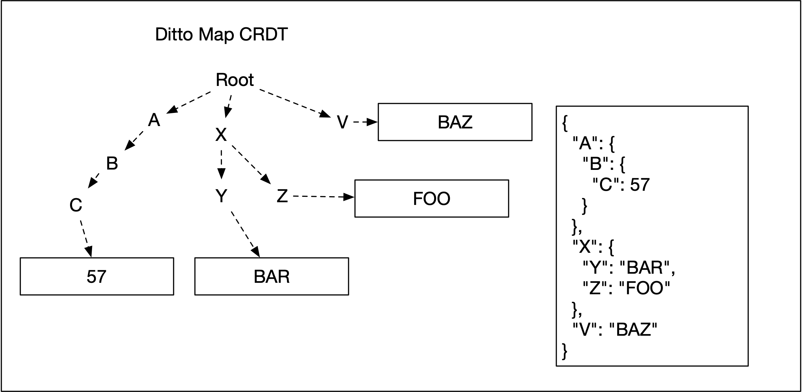
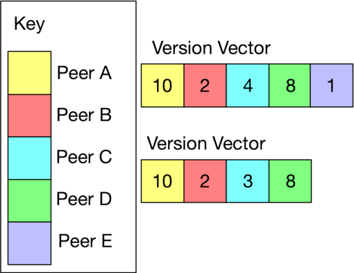
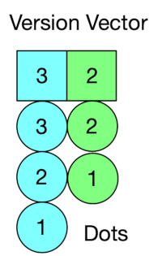
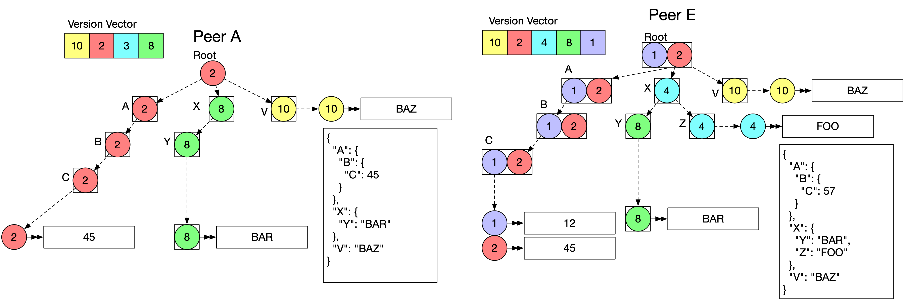
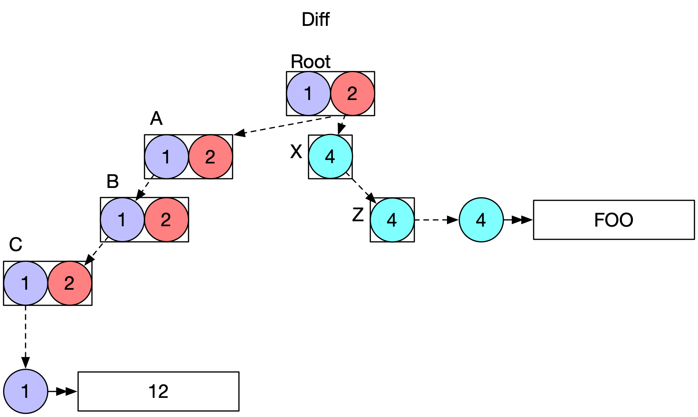

+++
title = "Ditto's Delta State CRDT"
date = "2023-09-19"
+++


**This post was originally written for and published on the [Ditto Blog](https://ditto.live/blog/dittos-delta-state-crdts).**

A [CRDT](https://crdt.tech) (Conflict-free Replicated Data Type) is data structure that can be used in a distributed system to enable concurrent updates to data.

In [my last post](../testing-crdts) I wrote about using stateful property-based testing to validate Ditto's CRDTs. My motivation for such testing was the need to design and implement a new CRDT for Ditto's Mesh database.

When writing about that new CRDT I realised that I first needed to write about the Delta based replication of Ditto's CRDTs.

### Why build a State-based CRDT?

Operation-based CRDTs are more commonly used in the applications you are familiar with.  This is because operations are great for long-running connections with temporary interruptions, and a defined set of peers. Think server-coordinated apps like Figma, where individual users are invited to a document via their web browser. This requires that there exists some notion of _all_ peers, which is incompatible with an ad hoc mesh, where peers can leave and join, recombine, make sub-meshes, and be disconnected for arbitrary periods of time. Defining "everyone" that exists in an ad hoc mesh is an open research area.

Due to the frequent offline operation, and ad hoc nature of membership, state based CRDTs are a more suitable answer for Ditto's mesh. Operation-based CRDTs offer smaller local state but require far more from the channels by which operations are delivered. For example, an operation based counter requires exactly once delivery to every peer. Operation-based CRDT maps require causal delivery to every peer. When a peer performs a series of operations over a single, or multiple documents, these operations must all be delivered in a causally consistent manner to each and every peer. Causally consistent means that if some change happens after or because of some prior change, the later change _must never_ be observed without the former. Causality describes a chain of dependencies that must not be broken.

For the sake of giving an intuition about causal consistency, imagine the following scenario:
On a social network Bob posts a message:
```
Bob: "I lost my cat"`
```

Then after some time, he posts:
```
Bob: "I found him! What a relief!"`
```
To which Sue replies:
```
Sue: "Great news!"
```
In an eventually consistent system these messages can be delivered in any order, so we might see
```
Bob: "I lost my cat"
Sue: "Great news!"
Bob: ...etc
```
Causal Consistency ensures that if a new message is written after seeing some prior message, then the new message is not visible unless that prior message is also visible.
To help differentiate Causal Consistency from stronger consistency models, imagine also that Alice replies to Bob’s good news with:
```
Alice: "Wonderful!"
```
Causal Consistency allows the two concurrent messages “Great news!” from Sue and “Wonderful!” from Alice can be shown in any order. Both:
```
Bob: "I lost my cat"
Bob: "I found him! What a relief!"
Sue: "Great news!"
Alice: "Wonderful!"
```
And:
```
Bob: "I lost my cat"
Bob: "I found him! What a relief!"
Alice: "Wonderful!"
Sue: "Great news!"
```
are allowed with Causal Consistency.
Ditto provides this causal consistency not just _within_ documents, but across documents.

Additionally, operation-based CRDTs require some form of external ordering and buffering. Operations cannot be forgotten by the system until they have been delivered to all peers. If we consider a log of operations, only when all peers have seen the operations can they be removed from the log. This is easy to say but hard to do.


State-based CRDTs place far fewer constraints on the channel by which data is replicated. All that is required is that eventually all data reaches all peers.

State-based CRDTs have merge functions that are idempotent, associative and commutative, meaning that the channel can reorder messages, and redeliver the same message many times, and the resulting data still converges. Being immune to re-order and redelivery means dropped messages don't matter either, as sending the same message multiple times is safe.


## Storage – who has what data?

A typical problem in peer-to-peer is how to store and retrieve data across devices with varying storage (think mobile phones and raspberry pis) and availability. Keeping a local database may not be enough to have the full scope of history, especially in peer to peer applications.

Additionally, in a centralized application, it is assumed that the owner will prioritize backing up all your data. If there was some natural disaster at one of Google’s data centers, for example, they have a variety of backups of your data in various locations around the world. But if users expect long-term storage across the world’s data centers, your peer-to-peer distributed database needs to provide timely information about status and availability of that data, either on a raspberry pi or a cloud service.
 To solve this problem, Ditto provides two versions of peers: a small peer, and a big peer. The database runs in the cloud (Big Peer) and on devices (Small Peer). The Small Peers create an Ad-Hoc Mesh of connected devices, and opportunistically replicate data to Big Peers whenever the internet is available.

### The CRDT

Ditto Small Peers each have a local database which stores documents. The document is a [CRDT Map](https://dl.acm.org/doi/abs/10.1145/2596631.2596633), where keys in the map can be thought of as properties of a JSON document. Each key points to a value that is itself a CRDT. The CRDTs inside a Ditto Document are:

- Last Write Wins Register
- Counter
- CRDT Map

The root of the Ditto Document is a CRDT Map, which makes the document a nested, recursive structure. You can think of it as a tree made up of data and metadata. A JSON document can be represented as a tree of maps, with the leaf values in registers or counters.



### Mesh, Subscriptions, Replication

A Small Peer Application is a partial replica of the total Ditto database. A Small Peer _subscribes_ to data via a query. When any pair of peers connect they exchange subscriptions. Any data on one peer that matches the subscription of the other is replicated. A key property of Ditto is that in a mesh of connected small peers with the same subscription, all peers must "eventually" have the same data.

### CRDTs and Mesh Consistency

"Eventually" describes the asynchronous, ad-hoc nature of the mesh and its connections. We can say that "eventually" means when the system is quiescent. The system is quiescent when every peer has stopped making changes, and has received every change made by every other peer. The system never has to literally reach quiescence for the property to hold: quiescence is just a way to think about "eventually". It describes a property where there is _convergence_ of the data. The system constantly works towards convergence by replicating data between peers.

If we imagine three small peers, each with all networks turned off, they can all edit the data in their local documents freely. When they turn on the network and connect to each other, the changes will be replicated between the peers, and all will have the same value locally: this is convergence. The example also shows _eventually_ they share a common, consistent view of the data. CRDTs enable this ability to *always* make progress locally by editing the CRDT, even when no connection is possible. CRDTs detect concurrent edits and converge to a single consistent value.


### Delta State Vs Full State

One downside of state based CRDTs is that traditionally the _full state_ of each CRDT must be replicated. With a large document that has only one or two frequently updated properties this is wasteful.

The introduction of [Delta State CRDTs](https://arxiv.org/abs/1603.01529) showed that there is a way to replicate _only deltas_ or differences in state, rather than the full state. However this can
bring a similar set of channel constraints as Operation-based CRDTs. For example, a device must store a buffer of deltas to send to its peers. It cannot truncate this buffer until all peers have received some stable prefix. Again, these deltas are suited to mostly-connected systems, with infrequent changes in membership.

At Ditto we developed a different approach: diffs. Diffs combine the minimal representation of deltas with the advantage of not requiring a buffer per peer in the system. (We later learned of a
[paper](https://dl.acm.org/doi/10.1145/2911151.2911163) that describes a similar technique.)

### Diffs (are Deltas)

Another way to avoid sending full state is to calculate the minimal state needed to bring a peer up-to-date.

#### Version Vectors and Dots

State-based CRDTs require some kind of logical clock. Logical clocks can capture the causal relationship between updates. Ditto uses Version Vectors, which enable the tracking of causality at the document level. They allow the system to detect if an update on Peer A comes after, before, or is concurrent with an update on Peer B. A version vector has a counter for each peer. The peer updates its own counter every time an edit event occurs. Ditto uses
[Hybrid Logical Clocks (hlc)](https://link.springer.com/chapter/10.1007/978-3-319-14472-6_2) for counters, they play the dual role of temporal clocks and logical counters.

There are a lot of reasons why temporal time is not a great way to order updates and detect concurrency within a system of connected peers in a distributed system (see
[Lamport](https://dl.acm.org/doi/10.1145/359545.359563), or the
excellent summary [There Is No Now](https://queue.acm.org/detail.cfm?id=2745385) by Justin Sheehy.)

Each Ditto Document has a Version Vector:




Ditto's replication protocol uses version vectors to keep peers in sync. As an illustrative simplification:

- Peer A and Peer B are subscribed to Document 1
- Peer A sends the Version Vector to Peer B
- Peer B looks at its own Version Vector for Document 1
- If the version vectors indicate that Peer B has information in
  Document 1 that Peer A does not, Peer B builds a Diff for Peer A
- The Diff is sent to Peer A and Peer A integrates the changes
- If Peer B now does the same, both peers will have the same data (convergence).

Ditto is able to build a Diff thanks to the structure of the CRDT
Map. Inspired by the Riak DT Map, it is a tree with some causal
metadata (dots) at each node that indicate the latest updates to that
node.

An event is an edit to a document. A dot is a single event in a version vector. For example, the Version Vector **`[(actor_1, 3), (actor_3, 2)]`** summarizes the events **`(actor_1, 1)`**, **`(actor_1, 2)`**,
**`(actor_1, 3)`**, **`(actor_2, 1)`**, and **`(actor_2, 2)`**. In fact at Ditto the Rust module for a Version Vector is called a **`Summary`**. When the document is edited we tag the tree structure with a dot for that event. This is more metadata (that compresses really well) _but_ it allows for efficient generation and merging of diffs.

A Dot or Event is observed, or seen by some Version Vector if the counter value in the dot is less than or equal to the counter value for that actor in the Version Vector. For example the dot **`(actor_a, 1)`** is seen by the Version Vector **`[(actor_a, 3), (actor_b, 2)]`** but the dot **`(actor_b, 3)`** has not been seen.



#### Calculating Diffs

Diff generation involves walking the tree from the root. If the root metadata is not covered by the remote version vector, consider the properties at the next level. If any properties are tagged with events that are unseen by the remote version vector, walk down until either a leaf is reached, or a node that has already been observed is reached.

The diff is the unseen leaf data and the paths through the tree to that leaf data.

This is best explained by the illustration below where Peer A and Peer E both subscribe to a document. In this illustration the event tags on the nodes of the tree can be seen. Where multiple peers concurrently update some node, there are multiple dots present in the metadata.



And the resultant diff to be sent from Peer E to Peer A is shown below:



Diff merging is the same process: walking the tree, applying the diff. Bear in mind that replication is asynchronous and may occur between multiple peers at once, and so Diff applications must take account of the current local version vector, in case of receipt of redundant data. Diff application, just like full state merge, is idempotent, commutative, and associative.

#### Tombstone Metadata

Nothing is for free, and by not using Deltas and their buffers, we are required to keep track of the removal of properties from a CRDT Map. We do this with a tombstone. In the original Remove Wins Ditto CRDT Map, the tombstone is the name of the property, and a single dot. A single dot is all that is needed. It marks the event of the removal. The application of the tombstone is simple too: if the receiving peer's version vector has _not_ seen the dot then the remove wins, and the data below that node in the tree is dropped. Removing a document
removes _all_ the data and leaves behind only a Version Vector and a tombstone.


## Summary

Ditto's replication protocol takes advantage of Version Vectors and the CRDT Map tree structure to replicate Diffs between peers in order to bring about convergence. Diffs, unlike deltas, do not require buffers, or known sets of peers, they are calculated when needed from the full state CRDT on disk.

Diffs _do_ require some more metadata, and for tracking removes they require some kind of tombstone. In Ditto's old Remove Wins Map the tombstone was a single dot. With Add Wins Maps this is more complex, and that is the subject of my next post!

### Interested in more content like this?

[Sign up at Ditto to register your interest](https://ditto.live/blog)
