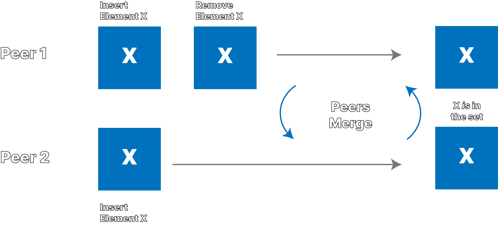
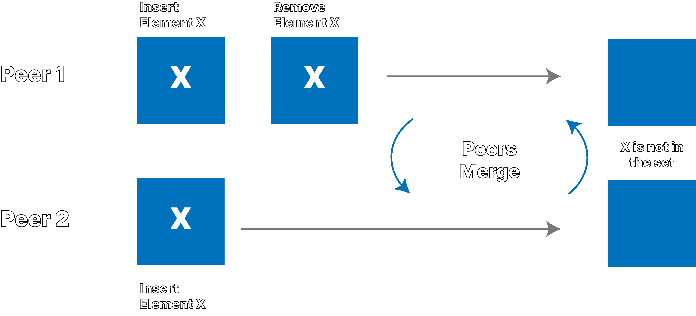

+++
title = "Testing CRDTs in Rust, From Theory to Practice"
date = "2022-04-05"
+++

**This post was originally written for and published on the [Ditto Blog](https://www.ditto.live/blog/testing-crdts-in-rust-from-theory-to-practice).**

Ditto is a database that puts theory in to practice. Ditto's peer-to-peer
data-structures, based on CRDTs, are deployed into real-world production
use cases. As we make improvements to the underlying data-structures,
we leverage stateful property-based testing to ensure that Ditto's
core data-structures maintain their robustness and stability. In this
article, we show how this type of testing helped reveal a surprising
problem in an academic paper's optimized CRDT.

## What Are CRDTs?

CRDTs are data-structures that can be used in distributed systems that
allow relaxed consistency models. They make handling conflicting
updates easier for programmers, and enable the development of
peer-to-peer and
["local-first"](https://www.inkandswitch.com/local-first/)
applications. They're the primary data-structure that developers work
with in Ditto's Document Database. CRDTs allow Ditto to integrate
concurrent changes from clients into a single, deterministic, and
meaningful value.

Over time the words that lend their initials to form the acronym CRDT
have often changed, it is usually accepted that CRDT stands for
Conflict-Free Replicated Datastructure, or in our case Convergent
Replicated Datastructures.

There has been a lot written about CRDTs, but a good starting place to
learn more is [crdt.tech](https://crdt.tech/)

Ditto uses a [State-based CRDT](https://docs.ditto.live/common/how-it-works/big-peer#ditto-crdts). State-based CRDTs use metadata inside
the data-structure to track causality and determine a value. We
developed a novel type of Delta-State CRDTs for Ditto, which we will
explain in more detail at a later date (stay tuned!) where the
differences between peers is calculated and sent over the network,
rather than sending the full state.

## Implementing A New CRDT

Ditto's database represents a document as a CRDT map with additional
nested CRDTs for values. Today, the Ditto Document currently only
supports Remove Wins behavior. My current task at Ditto is to create a
new CRDT Map that supports both Add Wins and Remove Wins
behavior. This is a novel data-type which allows the developer to
choose the behavior when performing a remove operation.

_Throughout this article I write mainly about Sets, as they are simpler
to describe and reason about, but what is discussed can also be extended to
Maps._

Add Wins and Remove Wins are choices in CRDT Set behavior. Given
concurrent updates to the same element in a Set, where one peer
inserts the element and another removes it, you have a choice: either
the Add Wins and the inserted element is in the Set, or the Remove
Wins and the element is not in the Set. In order to enable Remove Wins
behaviour, State-based CRDT sets tend to use some metadata, called a
tombstone, that marks an element as removed. To understand the
difference between Add Wins and Remove Wins, check out the graphics
below.

## Add-Wins Behavior



## Remove-Wins Behavior



Ditto observes this situation often from its customers in
the airline industry. Before takeoff, two flight attendants
with tablets or phones, in this case peer 1 and peer 2,
may download backend data before syncing with each other.
When these two disconnected flight attendants make concurrent,
offline edits to the database before syncing, as shown in the
graphics above, merging of the two devices results in
different behavior depending on the CRDT set behavior.

Remove Wins behavior can be surprising for some users, however. In general it
makes sense, as it does what it says: given any pair of concurrent add
and remove operations, the remove will win. However, with the
following sequence enacted concurrently by two peers, everyone is
surprised by the result:

1. Peer 1 adds element X to the set
1. Peer 1 removes element X from the set
1. Peer 1 re-adds element X to the set
1. Peer 2 adds element X to the set
1. Peer 2 removes element X from the set
1. Peer 2 re-adds element X to the set
1. Peer 1 merges with Peer2 and vice versa
1. X is _not_ in the set

To explain, the remove at step 2 on Peer One is concurrent with the
add (and re-add) on Peer Two. The remove at step 2 on Peer Two is
concurrent with the add (add re-add) on Peer One. When the sites
exchange data and merge into a single value the remove(s) win and the
Set is empty.

Given this peculiarity, Ditto wants to enrich the types available to
developers and offer both Add Wins and Remove Wins behavior. However,
designing and implementing CRDTs is a difficult task, we have an
impossibly large set of interleaving operations and orderings to test,
and we want to be certain that the result is deterministic across them
all. Property-Based Testing is an essential tool in the armory.

## What Is Property-Based Testing?

If you have never heard of property-based testing before watch
[this](https://www.youtube.com/watch?v=hXnS_Xjwk2Y). John Hughes is
one of the (grand?)daddies (sorry John) of property-based testing. A
stone cold genius, he has probably saved countless millions of
dollars, and maybe even lives since [inventing Quickcheck with Koen
Claessen](https://www.cs.tufts.edu/~nr/cs257/archive/john-hughes/quviq-testing.pdf)

There are lots of descriptions out there of property-based testing. In
general, it means generating the test cases, usually by generating
inputs. The programmer declares the _properties_ of the thing under
test and the library tries to generate cases that violate those
properties. When it does find some input that violates a property, it
will _shrink_ the input into a minimal failing case. The classic
example is that for all generated arrays as inputs, the reverse of the
reverse of an array is equal to the original array. This is compared
to unit testing where you make a bunch of arrays (empty?), hand
code the result, and say "expected == actual". Another common example
is round tripping for serialisation/deserialisation libraries. That
the result of serialise then deserialise for _any input_ is the same
as the original input is a classic property.

## Stateful Property-Based Testing

My personal favorite way of testing complex things, like distributed
systems or distributed data-structures, is to use EQC's Statem. This
is a stateful property-based testing module, that allows me to model
the system under test, generate a sequence of operations to run on
that system, and check that the system matches the model,
throughout. If some sequence of operations leads to a difference
between the model and the system under test (hereafter SUT),
quickcheck shrinks the operations to a minimal sequence.

With data-structures (like CRDTs) this is great. We can take an
"obviously correct", but poorly optimised implementation of a CRDT
(like the classic [Observe Remove Set](https://hal.inria.fr/inria-00555588/document)) and use it as the model, or
specification, for a better implementation, like the [Optimised Add
Wins Set](https://lip6.fr/Marc.Shapiro/papers/RR-8083.pdf).

We execute the same randomly generated set of operations on both
data-structures, and if there exists a difference between the behavior
of the implementations, quickcheck will tell us, and crucially SHRINK
the list of operations to a minimum. Then it is the programmer's job
to decide if the bug is in the model, the SUT, the test itself, or
some combination thereof.

Every time quickcheck finds a failing counter example, you save it,
and implement it as a unit test (for regression). Since the failing case was
generated randomly, you cannot be certain _that exact case_ will be
generated again.

It is an amazing tool. I've used it with Rustler to test Rust
code. However, not everyone at Ditto has a licence, and not everyone
at Ditto wants to learn Erlang. Even if I still think EQC statem is
the gold standard, it isn't what I used for this work, but
understanding the idea of generating a series of operations, and
applying them to a model and a "real" implementation is all you need to
take from this section.

## Poor Man's Rust Statem

A very basic attempt to copy the process of EQC statem would be to generate a
list of operations, and execute them. This process is described in a few places,
For example Tyler Neely's [post](https://medium.com/@tylerneely/reliable-systems-series-model-based-property-testing-e89a433b360).

In this case I use Rust Proptest to generate a Vector of operations to run on a
CRDT set. [^proptest-eqc]

## A Model (Specification) and a SUT

As a first step to supporting multiple behaviors in Ditto's document
I looked for prior art or existing literature and found the work of
André Rijo et al, specifically the OAR-Set in Rijo's 2018
[dissertation](https://run.unl.pt/handle/10362/55171) and the
optimised version in [this paper](https://arxiv.org/abs/1903.03487)
(also from 2018).

My idea was to use the Rijo OAR-Set as a model for the Map I was
making.

### Remove Wins vs Observed Add

In order to get a feel for the Set's semantics I implemented the
OA-Set, the OR-Set, and the OAR-Set, testing them against each
other using the basic model vs SUT approach described above.

The Observed Add behavior was new to me. It isn't a Remove Wins in
the sense that any remove concurrent with any add always
wins. Instead, the Observed Add allows for the "removal of removes"
that is to say in the case that re-adding something after observing
its removal means that the remove itself will no long have an effect
on some as yet unseen concurrent add. In a true remove wins set you
can end up with the surprising "mutual destruction" of two Peers as
described above who both:

1.  add element X to the set
1.  remove element X from the set
1.  re-add element X to the set
1.  merge

In this case, with Observed Add, when Peer One re-inserts they are in
effect saying "I'm removing my remove!" and so it has no effect on
concurrent adds. If you want to learn more about _how_ this is achieved,
you should [read the paper](https://arxiv.org/abs/1903.03487). It is
neat, and I wish I'd known about it before I made the Remove Wins Map!.

I was surprised by the Observe Add behavior, and wanted to better
understand it. I understand by doing, so I implemented the Optimised
OAR-Set from the paper. Naturally I tested the Optimised version as
the SUT against the unoptimised version as the model. I was surprised
to see they diverged.

## The Test; A Counter Example

The state of the system is modeled as a `BTreeMap<usize, (Model, SUT)>` where
the key `usize` is a "peer" in the distributed system.

The operations that the test performs on the system are:

```rust
    enum SetOp {
        Replicate { src_peer: usize, dst_peer: usize },
        Insert { peer: usize, elem: u64 },
        Remove { peer: usize, elem: u64 }, // this is the remove wins remove
        ObserveRemove { peer: usize, elem: u64 }, // this is the add wins remove
    }
```

The test generates a sequence of operations: a mutation operation happens at a
site, and replication merges the data _from_ the first site _to_ the second.
This models the replication of data from one site to another. Without any
distributed systems, networks, databases, replication protocols, threads or
parallelisation, we have a very basic but effective model of a distributed system.
Each operation is a step, or moment in time. We have a single set. We allow
concurrent updates to it. We arbitrarily replicate between pairs of sites.

After all operations are applied, we merge all sites into a single
value. This is the guarantee of [eventual
consistency](https://www.allthingsdistributed.com/2007/12/eventually_consistent.html):
when the system is quiescent (_i.e._, all peers have seen all operations)
there is a single common value. At each merge we check that the model
and SUT match, and at the end, when ALL sites are merged, we check
again that the model and SUT match.

Proptest found a failing case and kindly shrank the failing case down
to:

```rust
let shrunk_ops = vec![
    // Peer Zero inserts 0 ⇒ [0]
    SetOp::Insert { peer: 0, elem: 0 },
    // Peer Zero does a remove wins remove of 0 ⇒ []
    SetOp::Remove { peer: 0, elem: 0),
    // Peer Zero replicates to Peer Two ⇒ []
    SetOp::Replicate { src_peer: 0, dst_peer: 2 },
    // Peer Two (re)-adds (and has observed the remove wins remove (in OARSet this "removes the remove")) ⇒ [0]
    SetOp::Insert { peer: 2, elem: 0 },
    // Peer One inserts 0 (it has _not_ seen the earlier remove) ⇒ [0]
    SetOp::Insert { peer: 1, elem: 0 },
    // Peer Two observe removes 0 ⇒ []
    SetOp::ObserveRemove { peer: 2, elem: 0 },
];
```

At some step the test failed because the model value was `[0]` and the
SUT was `[]`.

## The Difference

The job of the programmer is now to figure out _why_ the model and the
SUT diverge. In this case I had a hunch, so I augmented my test to
merge the final state in all possible permutations, and this showed
that in some orderings the final sets matched.

If we start by merging Peer One into Peer Zero, and then merge Peer
Two into the result (_i.e._ `(Peer Zero <- Peer One) <- Peer Two`) the
divergence happens when Peer Two is merged into the result of the merge of
Peer One into Peer Zero. This is because when we merge Peer One into
Peer Zero, we _lose_ the `0` element from the set. Peer One still has
the Observe Add tombstone (recall that it was _Peer Two_ that removes
the remove by re-adding `0` to the set.) The tombstone at Peer Zero
acts on the element on Peer One.

In the optimised specification a remove ACTUALLY REMOVES the element;
it is forgotten (that's part of the optimisation). When we then merge
Peer Two, the unoptimised set still has the element `0` in the set,
and notices that the tombstone itself was "removed" by the re-add at
Peer Two, and so the add on Peer One becomes concurrent with the
`observe remove` on Peer Two (Observe Remove _means_ Add Wins).

Well done property testing! The paper passed review and was accepted
in the national informatics conference INForum 2018, but a six-step
run with 3 peers shows the specs don't match. That isn't a critique of
the work or the scientific process, but rather an endorsement of the power
of stateful property-based testing.

Not only do the specs not match, it also shows that the spec for the
Optimised OAR-Set is not actually a CRDT, as a State-based CRDT's
Merge function must be idempotent, commutative, and associative. For
example, if we merge the Peers in the order `(Peer Two <- Peer Zero)<- Peer One`
then the SUT matches the model.

## The Fix?

I wanted to fix it for the sake of the blog post, and for my own
understanding. I'm not sure my fix is great, as it isn't really in the
_spirit_ of "optimised." My changes are in `merge` and `lookup` of the
spec.

In `merge` we _never_ remove/forget a value from the `Add` set, even
if it appears to be tombstoned by the merge. In `lookup` merely being
present in the `Add` set with timestamps is no longer enough, the
element must also _NOT_ be present in the `Remove` map. That's it. Now
they match, the property test passes, and the Set _is_ a CRDT.

# Conclusion

I contacted André Rijo and Nuno Preguiça about this work, and they
were generous of their time in discussing it with me, agreeing that
I had found a genuine issue in the paper: that the optimised
specification does not match the OARSet specification.

Deletes in distributed systems are hard, and the Observed Add semantic
from these papers is a valuable alternative to the harsher Remove Wins
behavior.

This posts illustrates just how hard it is to make correct CRDTs, and
why tools like Stateful Property-Based Testing are so valuable.

Look out for the new types coming soon to the Ditto Platform.

[^proptest-eqc]: There is a [PR](https://github.com/AltSysrq/proptest/pull/257) open on Proptest that adds EQC Statem-like features to Proptest. 🤞
