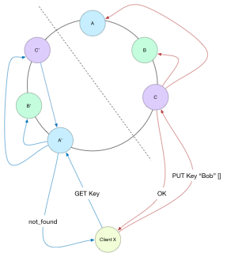
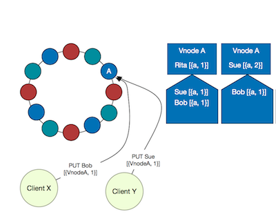

+++
title = "Vector Clocks Revisted"
date = "2015-10-06"
+++

Vector Clocks Revisited
=======================

In our everyday lives we use the notion of time to order events: get up before breakfast, eat before work, etc. As this excellent [ACM](https://queue.acm.org/detail.cfm?id=2745385) article shows, time can be complex in a distributed system.

This is the first of three blog posts about changes to Riak’s logical clocks. They cover a lot of ground: over 3 years. The aim is to write about my latest work with logical clocks in Riak, but in order to have a context, we first need to go back in time.

Back in 2010 Riak engineers published two seminal blog posts about Vector Clocks and Riak: [“Why Vector Clocks Are Easy”](https://riak.com/why-vector-clocks-are-easy/index.html) and it’s companion piece [“Why Vector Clocks Are Hard.”](https://riak.com/why-vector-clocks-are-hard/index.html)

These two posts are still very valuable, and worth reading, but a lot has changed since then. This series of posts will hopefully bridge the gap.

**Why The Logical Clocks?**
---------------------------

Riak KV is an eventually consistent key-value database that favours write availability. To achieve this, it allows multiple clients to write concurrently, potentially to the same key. Riak KV uses logical clocks to track the history of updates to values, and detect _conflicting_ writes.

From here on, these logical clocks will be referred to as _Version Vectors_, with thanks to [Carlos Baquero](https://twitter.com/xmal) and this [blog post](https://haslab.wordpress.com/2011/07/08/version-vectors-are-not-vector-clocks/).

**Part 1: Vnode Version Vectors**
---------------------------------

The subject of this first post is a major change to Riak KV’s logical clocks in the 1.0 release back in September 2011. At that time Riak KV moved from _client side IDs_ to _vnode IDs_. In the [“Why Vector Clocks Are Hard”](https://riak.com/why-vector-clocks-are-hard/index.html) article mentioned above the author explains that this is a difficult thing to do, but the benefits appeared to outweigh the costs.

But, before all that, some basics.

### **A Note on Notation**

Throughout this post I use a sort of [Erlang](http://erlang.org/)\-like syntax.

```Erlang
%% This is a comment
\[\] %% This is a list
{} %% This is a tuple
Uppercase\_word %% This is a variable
lowercase %% This is an atom
1007 %% this is a number
Var = \[{atomx, Var1}, {atomz, Var2}\] %% this is a binding that says Var is equal to this list
```

### **Version Vector Recap**

Skip down to the next section if you already know how Version Vectors work.

A Version Vector is a data structure that summarises the history of updates to a value. In Riak each Key has its own Version Vector. The data structure is a list of pairs of Actor and Counter.

```Erlang
[{Actor , Counter}]
```

An _`actor`_ is some entity in the system that makes updates to a object. The actor is the unit of concurrency in the system. Examples might be a server, a client, a virtual node, a process, a thread. Anything that can be uniquely identified and performs actions.

When an actor updates a key it will increment only it’s own entry in the vector. An actor’s entry is a summary of all the updates that actor has performed. If an actor is not present in the vector, its counter is agreed to be at zero. As each entry is a summary of an actor’s updates, the whole Version Vector summarises all the updates to the key from all the actors in the system.

```Erlang
A = [{a, 3}, {b, 2}, {c, 1}]
```

In Version Vector **`A`** above three actors have updated the key. Actor **`a`** has issued three updates, **`b`** two, and **`c`** has issued one.

On its own, this does not tell us much. Version Vectors are usually considered in pairs.

```Erlang
A = [{a, 3}, {b, 2}, {c, 1}]
B = [{a, 3}, {b, 2}, {c, 1}]
```

This pair of Version Vectors, **`A`** and **`B`** above, are equal. They describe exactly the same set of events, or _`history`_.

```Erlang
A = [{a, 2}, {b, 2}, {c, 1}]
B = [{a, 3}, {b, 2}, {c, 1}]
```

In the pair **`A`** is an ancestor of **`B`**. We say that **`B`** _`dominates`_ **`A`**. **`B`** has seen an extra event `({a, 3})` which means its clock showing a later logical time than **`A`**. You can think of _`dominates`_ as _`greater than`_:

```Erlang
B > A
```

When Riak considers the values represented by these Version Vectors it can discard **`A`** as all its information is contained in **`B`**. This is more meaningful than just a greater temporal timestamp; with a dominated Version Vector we _`know`_ for certain that the events in **`A`** caused **`B`**. A wall-clock derived timestamp does not convey this information.

_`Dominates`_ is a stricter relationship than _`descends`_. For any pair of Version Vectors **`A descends B`** if **`A`** summarises all the events **`B`** does. So the _`equal`_ Version Vectors, like in the pair above, descend each other. You can think of _`descends`_ as _`greater than or equal`_. If **`B`** descends **`A`** then **`B >= A`**.

```Erlang
A = []
B = [{a, 1}]
```

In the pair above **`B dominates A`**. All Version Vectors descend the empty Version Vector, and this single event means **`B`** summarises events does not.

```Erlang
A = [{a, 1}]
B = [{b, 1}]
```

This pair of Version Vectors are in conflict, or _`concurrent`_.  A pair of Version Vectors **`A`** and **`B`** are concurrent if **`A`** summarises events unseen by **`B`** _`AND`_ **`B`** summarises events unseen by **`A`**. Actors **`a`** and **`b`** have updated the value “at the same time”. And this is the magic of Version Vectors. They allow Riak to detect concurrent writes to a key, and store sibling values. This would be impossible with wall-clock time due to lack of perfect precision, synchronization, and information about causality.

When there is conflict, or concurrency, it needs to be resolved by a write, and that write is a new event. First _`merge`_ **`A`** and **`B`** and provide the resulting Version Vector to the client as a context. This ensures the next write descends both **`A`** and **`B`**.

```Erlang
A   = [{a, 1}]
B   =         [{b, 1}]
AB  = [{a, 1}, {b, 1}]
```

Merging two Version Vectors takes the [pairwise maximum](https://en.wikipedia.org/wiki/Pairwise_comparison) of each entry. See **`AB`** above. This merged Version Vector dominates both **`A`** and **`B`**. When Actor **`c`** issues a new update, it will increment its counter in this merged Version Vector, ensuring the new value overwrites both the conflicting values as **`ABC`** `_dominates_` **`A`**, **`B`**, and **`AB`**. Riak will store the merged Version Vector with the new value as the **`frontier`**, or latest logical time.

```Erlang
ABC = [{a, 1}, {b, 1}, {c, 1}]
```

To summarise: actors working serially update their own entry in a vector moving logical time forward in discrete events. Conflict, ancestry, and dominance can be established by comparing logical clocks for a key.

With the basics dealt with, on to the subject of this post. Before we look at what **`Vnode Version Vectors`** are, why would we want them?

### **Actor Explosion**

Prior to Riak 1.0, the **`actor`** in the Version Vector was provided by the Client Application. A client would perform a read, modify the returned value, and issue a new write, sending Riak the Version Vector it read, a _`Client ID`_, and the new value. Riak would then increment the Client’s entry in the Version Vector, meaning this new write dominates the value(s) it read, and store it on disk.

In the worst case, an application might start a thread for each PUT operation, pass the `thread ID` to Riak as a client ID, then exit on completion. Imagine 10 application servers, each serving 1000s of concurrent requests, each sending a single-use-actor-id. The result is Version Vectors far larger than the data, and frequent, aggressive vclock pruning. Remember that “In a real world scenario with long-lived data, each data element would end up with a vector clock with a length proportional to the number of clients that had ever [modified it](/why-vector-clocks-are-hard/index.html).” Which sounds [familiar](http://dl.acm.org/citation.cfm?id=117606).

But that is not the worst of it.

### **Client Complexity**

Using Client IDs in Version Vectors means client _applications_ enforce database invariants. While it is merely preferable that actors are long lived, for fewer IDs in a Version Vector, there are invariants that _must_ be maintained:

*   Each actor _must_ be unique.
*   Each new update must be accompanied by a strict increase in the event counter. That is each update the actor produces _must_ increment the event counter in the vector to a value greater than before; an individual actor _must_ always issue a strictly increasing total order of events.

The most common way to satisfy these invariants is to enforce that:

*   An actor _must_ act serially.
*   An actor _must_ only update it’s own entry in a Version Vector.

Breaking either of these invariants leads to incorrect behaviour, the worst of which is silent data loss. This is a lot to ask of a client application, and somewhat more than the implied contract of “provide an ID, and the last vector clock you saw for a given value.”

Worse still, back when Riak used client IDs, there was an edge case that made maintaining these invariants impossible under certain failure scenarios.

### **Read Your Own Writes (RYOW)**

In order for a _client_ to issue a strictly increasing order of events, it must _know_ the last event it issued. Since Riak is eventually consistent, there is no guarantee that a client will read its last write, unless it issues the write to **`PW`** primary replicas, and reads the result from **`PR`** primary replicas such that

```Erlang
PW+PR > N
```

Where **`N`** is the number of replicas for the key.

This guarantees that some Primary **`P`** is in both the read and write quorum. This is called a _strict quorum_ as opposed to Riak’s default _sloppy quorum_ settings.

Requiring a strict quorum reduces the _Availability_ of Riak in the case of node failures or network partitions.

#### History Repeating

What happens when you don’t read your own writes? Before looking at an example, here’s Riak’s pre-1.0 algorithm for Version Vectors.

*   Client Gets Value+Version Vector for Key
*   Client Sends Put Request to Riak with Value and ClientID and Version Vector
*   Riak increments the entry for ClientID in Version Vector
*   At each of **`N`** Vnodes:
    *   Read local value from disk
    *   If local Version Vector descends incoming Version Vector ignore write (you’ve seen it!)
    *   If Incoming Version Vector descends local Version Vector overwrite local value with new one
    *   If Incoming Version Vector is concurrent with local Version Vector, add new value as **sibling**

Working correctly depends on that first step. That context from the GET absolutely _must_ contain the highest event the Client ID has issued.

Why? Simply to add one to the Version Vector and for the result to be a _new_ event, a greater counter, and a later logical time, for this actor than previous events.



We can come up with a pretty simple example where data is lost. Any condition that causes a disjoint read and write set, (say read from **`[A’, B’, C’]`** and get **`not\_found`**, write to **`[A, B, C]`**, repeat.) Each write will have the same Version Vector entry of **`[{X, 1}]`**, meaning that after an initial write, all subsequent writes will be dropped, as per the algorithm above:

```Erlang
Local = [{X, 1}] %% descends
Incoming = [{X, 1}]
```

And there are many permutations of failures, partitions, and slow responses that can lead to not reading your own writes.

The cause of the issue is that the same _event_ **`{X, 1}`** tagged two different things. Each event in a Version Vector is a _unique_ moment in logical time. Two Version Vectors that are equal _must_ represent the same history. In this case **`[{X, 1}]`** could be one of two writes, with potentially different values! In other words, without Read Your Own Writes, Version Vectors may fail to detect concurrent updates: _their one and only job_.

#### So Read Your Own Writes!

Riak does not ship with **`PW=quorum`** and **`PR=quorum`** by default: Riak believes people choose Riak for _availability_. However, if you were aware of the requirement to Read Your Own Write, and set the correct options, there was a bug that may mean you would not Read Your Own Writes, but believe that you had.

Riak 1.0 fixed the [bug](https://github.com/basho/riak_kv/pull/485), but by then, we had _Vnode Version Vectors_.

### **This One Weird Trick**

In order to relieve the client application of the burden of ID management Riak Engineers figured out a way to have the [_vnodes_](https://docs.riak.com/riak/latest/theory/concepts/vnodes/index.html) be the actors in the system. This makes perfect sense, as the vnode is already the unit of concurrency in Riak.

In the  [“Why Vector Clocks Are Hard”](https://riak.com/why-vector-clocks-are-hard/index.html) post the author describes an issue with _Server Actor IDs_ that is identical to the repeating-history bug above. Namely two different events that were in fact concurrent get the same Version Vector. How does this happen?



*   Clients **`X`** and **`Y`** both read key **`K`** and get **`Rita`** **`[{a, 1}]`**
*   Client **`X`** PUTs “bob”
*   Client **`Y`** PUTs “sue”
*   Riak vnode **`a`** handles the **`Y`** PUT, sets the Version Vector to **`[{a, 2}]`** and value to “Sue”
*   Riak vnode **`a`** handles the **`X`** PUT…

What should the vnode do? The incoming Version Vector is **`[{a, 1}]`**. Vnode a can increment its entry, creating the vector **`[{a, 2}]`**, but then we have two different values with the same Version Vector. We failed to capture concurrency, and some write ends up lost.

We could read the local value for **`K`** and see the Version Vector is **`[{a, 2}]`** which _dominates_ the incoming **`[{a, 1}]`** and discard the incoming write. This seems unfair, as in any _race_, only one client can _“win”_ (some databases do this with wall clock time!)

We could tweak the Version Vector algorithm:

*   If local Version Vector _descends_ Incoming Version Vector, add new value as **sibling**.

This trick introduces _false concurrency_ and allows us to store “Sue” and “Bob” as sibling values, while discarding “Rita” as an ancestor of the incoming Version Vector **`[{a, 1}]`**.

### **It’s all good**

It also has the handy benefit that badly behaving clients that do not retrieve a Version Vector before writing will still generate a sibling on PUT, meaning their write values are stored, rather than being silently discarded as _seen_.

What have we achieved? Smaller Version Vectors: in the order of the number of replicas for the key (by default 3 in Riak). Simpler for clients: for best behaviour provide the latest Version Vector you’ve seen when you issue a PUT, but of the Version Vector is _stale_ it doesn’t matter, your value will be stored as a sibling.

In short:

*   No more Read Your Own Writes
*   Smaller Version Vectors
*   Simpler clients

### **Downside?**

#### Idempotent PUTs

On the downside Vnode Version Vectors lose _idempotent_ PUTs.

With Client IDs if some client A sends a PUT with ID X and clock **`[{X, 2}, {Y, 3}]`** and Riak fails to answer, but stores the write, re-issuing the same write will be _idempotent_. With _Vnode Version Vectors_ re-issuing the write generates a sibling with an identical value. However Riak side-steps that by storing a **`Set`** of siblings values.

#### Coordinating Vnode

Another downside is that there must be a coordinating vnode to increment the Version Vector. This means that when a request reaches Riak, the `preference list` must be consulted and a vnode on the `preference list` is chosen to coordinate the `PUT`. If the node that received the request is not on the preference list, then the request must be _forwarded_ to a node that is: this introduces some latency to a `PUT`.

#### Sibling Explosion

As a result of false concurrency riak is unable to accurately discern truly concurrent writes from interleaved writes, leading in the worst case to an “explosion” of sibling values. This is fixed in Riak 2.0, so don’t panic! This “sibling explosion” is also the subject of the next blog post.

**Summary**
-----------

Since we released Riak 1.0, we no longer need to talk about “vclocks”, but instead a “causal context” or just “context”. Vnode Version Vectors solved some difficult issues for Riak users around availability and client process management, but they came with some costs. For the sake of completeness, here are the [release notes for Vnode Version Vectors](https://github.com/basho/riak/blob/1.0/RELEASE-NOTES.org#getput-improvements).

Next time we’ll look at that “sibling explosion” bug in Vnode Version Vectors, and how academic intervention saved the day.
